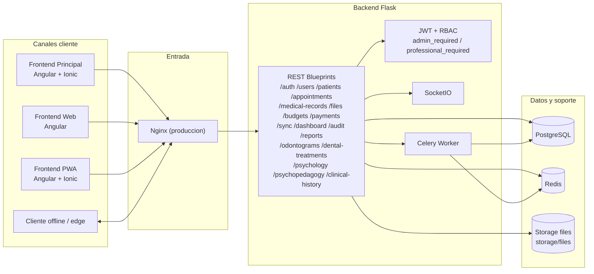

# Medical Services - Architecture (estado actual)

Actualizado: 2026-02-23

## Resumen
Medical Services es una plataforma clinica modular con backend Flask y tres clientes frontend en distinto nivel de madurez funcional.

## Flujo operativo
- Ver flujo operativo integral por actores en `docs/architecture/operational-flow.md`.

## Diagrama Mermaid (estado actual)

## Componentes principales

### Backend API (`backend/`)
- Stack: Python, Flask, SQLAlchemy, Marshmallow.
- Seguridad: JWT + controles por rol en endpoints sensibles.
- Recursos registrados en `backend/app/__init__.py`:
  - auth, users, professionals, patients
  - appointments, medical_records, files
  - budgets, payments, sync, dashboard, audit, reports
  - odontograms, dental_treatments, psychology, psychopedagogy, clinical_history, logs
- Servicios transversales: cache Redis, Celery, Flask-SocketIO, migraciones con Flask-Migrate.

### Frontend principal (`frontend/`)
- Angular + Ionic.
- Cliente con mayor cobertura funcional.

### Frontend web (`frontend-web/`)
- Angular standalone.
- Build validado localmente el 2026-02-23.

### Frontend PWA (`frontend-pwa/`)
- Angular + Ionic.
- Build validado localmente el 2026-02-23 con warnings no bloqueantes de tooling/CSS.

## Datos y almacenamiento
- Datos transaccionales: PostgreSQL.
- Cache y broker: Redis.
- Archivos: storage local (`storage/files`) con endpoints `files`; existe configuracion S3 para escenarios futuros.
- Trazabilidad de sincronizacion: tabla `sync_logs`.

## Sincronizacion
- Endpoints disponibles en `backend/app/resources/sync.py`:
  - `POST /api/sync/push`
  - `GET /api/sync/pull`
  - `GET /api/sync/status`
  - `GET /api/sync/logs` (admin)
- Capacidades actuales:
  - validacion de payload
  - limite de lote (`MAX_SYNC_CHANGES=500`)
  - idempotencia por `idempotency_key` o fingerprint
  - conflictos por `updated_at` con politica `server_wins`
- Alcance actual de entidades sync: appointments, medical_records, budgets, payments, files.

## Despliegue

### Desarrollo
- `docker-compose.yml`: postgres, redis, backend, celery, frontend-web, frontend-pwa.
- `docker-compose.db.yml`: postgres + pgAdmin para entorno de datos.

### Produccion base
- `docker-compose.prod.yml`: postgres, redis, backend, celery, nginx.
- Requiere cerrar healthchecks, observabilidad y politicas operativas para release estable.

## Validaciones tecnicas recientes
- Backend: `pytest backend/tests/test_patients.py backend/tests/test_sync_endpoints.py` -> `42 passed` (2026-02-23).
- Frontend web: `npm --prefix frontend-web run build` -> OK (2026-02-23).
- Frontend PWA: `npm --prefix frontend-pwa run build` -> OK con warnings no bloqueantes (2026-02-23).

## Riesgos actuales
- Sincronizacion aun limitada a un subconjunto de entidades.
- Paridad funcional incompleta entre frontends secundarios y backend.
- Hardening operativo de produccion aun pendiente en compose/productivo.

## Criterio de arquitectura estable (release candidate)
- Contrato API y documentacion alineados.
- Paridad funcional completa en al menos un frontend de produccion.
- CI con tests backend y build frontend en verde de forma consistente.
- Operacion productiva con backup/restore, monitoreo y rollback validados.
