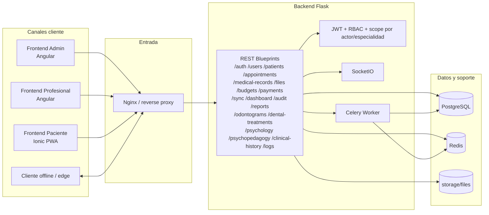

# Medical Services - Architecture (estado actual)

Actualizado: 2026-02-25

## Resumen
Medical Services es una plataforma clinica modular con backend Flask y tres frontends separados por actor (`admin`, `professional`, `patient`) sobre una misma API.

## Flujo operativo
- Ver flujo operativo por actor en `docs/architecture/operational-flow.md`.

## Diagrama Mermaid (estado actual)

## Componentes principales

### Backend API (`backend/`)
- Stack: Python, Flask, SQLAlchemy, Marshmallow.
- Seguridad: JWT + RBAC + validaciones de alcance por actor/especialidad.
- Recursos: auth, users, professionals, patients, appointments, medical-records, files, budgets, payments, sync, dashboard, audit, reports, odontology, psychology, psychopedagogy, clinical-history, logs.
- Servicios transversales: Redis, Celery, Flask-SocketIO, migraciones Alembic.

### Frontends por actor
- `frontend-admin-profesional/`: Angular para `admin`.
- `frontend-profesional/`: Angular para `professional`.
- `frontend-paciente/`: Ionic PWA para `patient`.

## Datos y almacenamiento
- Datos transaccionales: PostgreSQL.
- Cache/broker: Redis.
- Archivos clinicos: `storage/files` con endpoints `files`.
- Trazabilidad de sync: `sync_logs` (incluye idempotencia y version resultante por entidad).

## Sincronizacion (estado real)
- Endpoints: `POST /api/sync/push`, `GET /api/sync/pull`, `GET /api/sync/status`, `GET /api/sync/logs`.
- Capacidad implementada: limite de lote (`MAX_SYNC_CHANGES=500`), idempotencia por `idempotency_key` (con reserva previa para concurrencia), conflictos por politica de entidad (`version_then_timestamp` / `version_only`) y versionado por registro (`sync_version`) en `appointments`, `medical_records`, `budgets`, `payments`, `files`.
- Ver detalle en `docs/architecture/sync-strategy.md`.

## Despliegue

### Desarrollo
- `docker-compose.yml`: postgres, redis, backend, celery, frontend-admin, frontend-web, frontend-pwa.
- `docker-compose.db.yml`: stack de datos.

### Produccion base
- `docker-compose.prod.yml`: postgres, redis, backend, celery, nginx.

## Estado de madurez
- Funcional: UC-MS-001..UC-MS-017 cerrados (ver `docs/development/UC_RF_VERIFICATION_2026-02-24.md`).
- Tecnico pendiente: hardening operativo release (healthchecks avanzados, alertas, validaciones periodicas de rollback/restore) y E2E integral en entorno de despliegue.

## Criterio de arquitectura estable (release candidate)
- Build/test backend + 3 frontends en verde.
- Smoke/E2E por actor en entorno de despliegue.
- Runbooks operativos vigentes (backup/restore/rollback) con validacion periodica.
