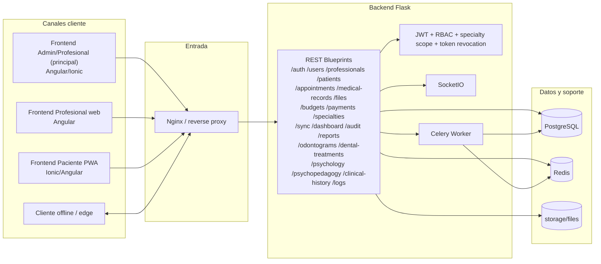

# Medical Services - Architecture (estado actual)

Actualizado: 2026-03-01

## Resumen
Medical Services es una plataforma clinica modular con:
- backend Flask REST,
- 3 frontends por actor (admin/profesional/paciente),
- alcance clinico segmentado por `specialty_key`,
- despliegue Docker Compose con healthchecks y arranque condicionado por salud.

## Flujo operativo
Ver `docs/architecture/operational-flow.md`.

## Diagrama Mermaid (estado actual)

## Componentes principales

### Backend (`backend/`)
- Stack: Python, Flask, SQLAlchemy, Marshmallow.
- Seguridad: JWT + RBAC + validaciones de alcance por actor/especialidad.
- Revocacion de sesiones: `POST /api/auth/logout` con blocklist (`token_in_blocklist_loader`).
- Dominios REST activos: auth, users, professionals, patients, appointments, medical-records, files, budgets, payments, sync, dashboard, audit, reports, odontology, psychology, psychopedagogy, clinical-history, specialties, logs.
- Infra backend: Redis, Celery, Alembic, Flask-SocketIO.

### Frontends
- `frontend-admin-profesional/`: app principal para `admin` y flujos avanzados de `professional`.
- `frontend-profesional/`: workspace web de `professional` con scope por especialidad/pacientes asignados.
- `frontend-paciente/`: PWA del `patient` para turnos, historia, presupuesto y perfil.

## Datos y almacenamiento
- Transaccional: PostgreSQL.
- Cache/broker: Redis.
- Archivos clinicos: `storage/files`.
- Trazabilidad de sync: `sync_logs` + `sync_version` por entidad.

## Sincronizacion
- Endpoints: `POST /api/sync/push`, `GET /api/sync/pull`, `GET /api/sync/status`, `GET /api/sync/logs`.
- Capacidades: limite de lote (`MAX_SYNC_CHANGES=500`), idempotencia por `idempotency_key`, politicas de conflicto por entidad y versionado por registro.
- Detalle: `docs/architecture/sync-strategy.md`.

## Despliegue
- `docker-compose.yml` (dev full stack): postgres, redis, backend, celery, frontend-web, frontend-admin, frontend-pwa.
- `docker-compose.db.yml` (solo datos): postgres + pgadmin.
- `docker-compose.prod.yml` (base prod): postgres, redis, backend, celery, nginx.
- `docker-compose.yml` y `docker-compose.prod.yml` tienen healthchecks y `depends_on: condition: service_healthy`.

## Estado de madurez
- UC funcionales: verificados en `docs/development/UC_RF_VERIFICATION_2026-02-24.md`.
- Operacion por olas: `scripts/orchestration/wave_orchestrator.py` y `docs/development/WAVE_EXECUTION_AUTONOMA.md`.
- Evidencia continua: `docs/development/solid_activity_tracker.md`.

## Criterio de arquitectura estable
- Build backend + 3 frontends en verde.
- Tests backend + E2E por actor en verde.
- Runbooks de backup/restore/rollback vigentes.
