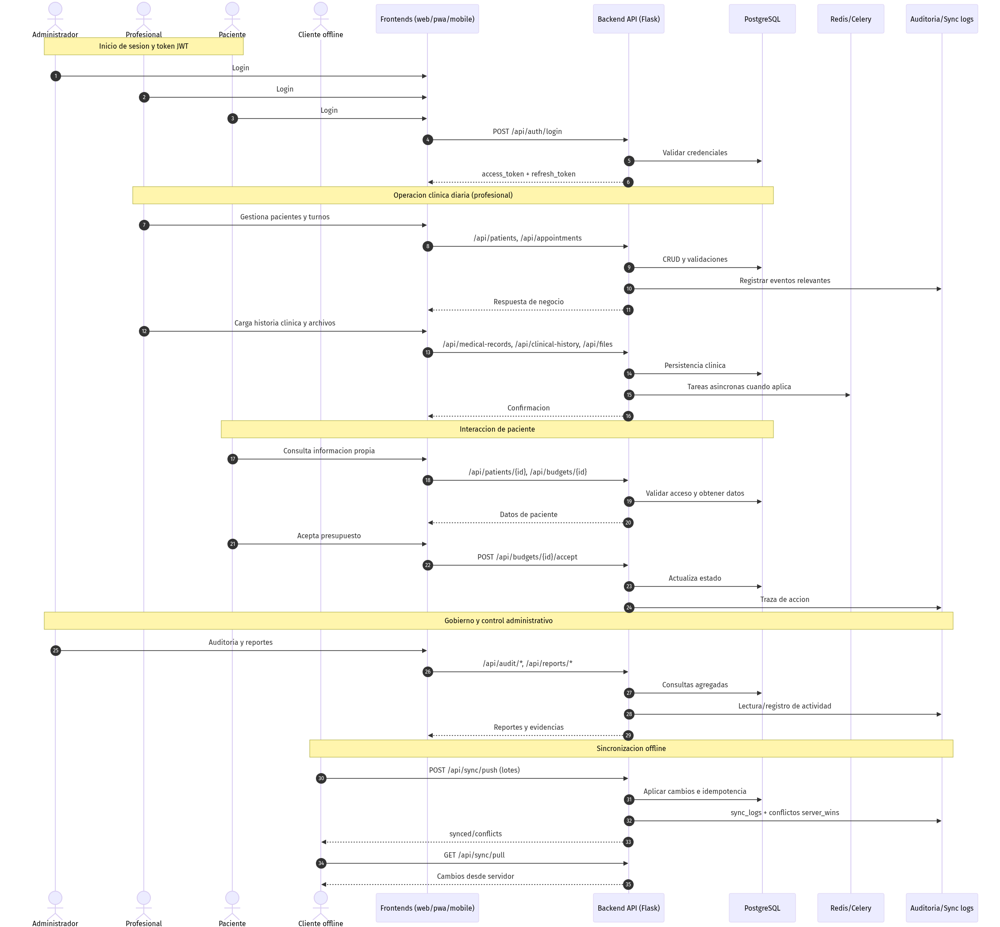
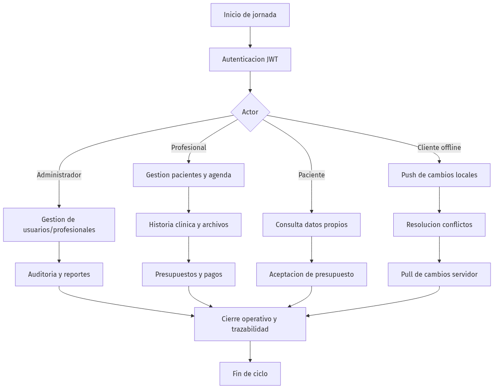

# Flujo Operativo del Sistema

Actualizado: 2026-03-01
Sistema: Medical Services

## 1. Objetivo

Definir el flujo operativo integral del sistema con los actores activos:
- Administrador
- Profesional
- Paciente
- Cliente offline

El flujo esta alineado con los casos de uso UC-MS-001..UC-MS-017 y con los endpoints vigentes del backend.

## 2. Actores y responsabilidad operativa

| Actor | Responsabilidad principal |
|---|---|
| Administrador | Gobierno del sistema: usuarios, profesionales, auditoria, reportes, monitoreo de sync. |
| Profesional | Operacion clinica diaria: pacientes propios, turnos, historia clinica, presupuestos, pagos y modulos segun especialidad. |
| Paciente | Consulta/autogestion de informacion propia (perfil, turnos, presupuestos, historial) y visibilidad de sus profesionales tratantes. |
| Cliente offline | Emite cambios locales y sincroniza con nube (push/pull) con control de conflictos. |

## 2.1 Frontends por actor

| Frontend | Stack | Actor habilitado | Regla de acceso |
|---|---|---|---|
| `frontend-admin-profesional` | Angular | Administrador y Profesional | App principal para gobierno (`admin`) y operacion clinica avanzada (`professional`) por especialidad. |
| `frontend-profesional` | Angular | Profesional | Workspace profesional web con scope por pacientes asignados y `specialty_key`. |
| `frontend-paciente` | Ionic (PWA) | Paciente | Acceso exclusivo para `patient`; solo datos propios y profesionales vinculados. |

## 3. Flujo operativo end-to-end (secuencia)

Fuente editable: `docs/uml/operational_flow_sequence.mmd`

## 4. Flujo operativo continuo (ciclo diario)

Fuente editable: `docs/uml/operational_flow_cycle.mmd`

## 5. Controles transversales del flujo

- Autenticacion JWT en endpoints operativos.
- RBAC en operaciones sensibles (`admin_required`, `professional_required`).
- Revocacion de token en `logout` via blocklist.
- Scope clinico por especialidad (`specialty_key`) y asignacion profesional-paciente.
- Trazabilidad por auditoria y `sync_logs`.
- Limites de lote e idempotencia en sincronizacion.
- Persistencia central en PostgreSQL y soporte asyncrono con Redis/Celery.

## 6. Referencias

- `docs/requirements/REQUISITOS_FUNCIONALES_CASOS_USO.md`
- `docs/architecture/architecture.md`
- `docs/architecture/sync-strategy.md`
