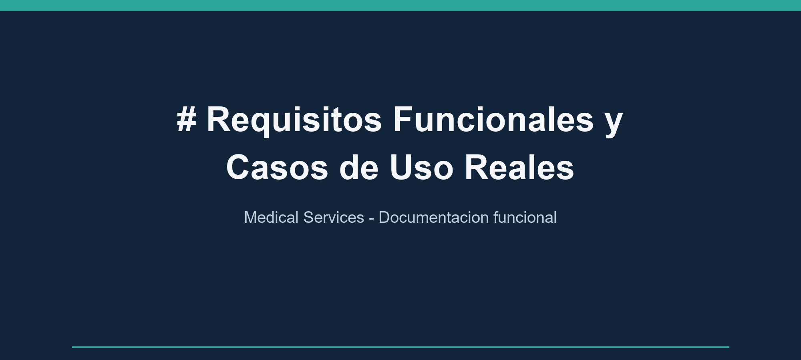
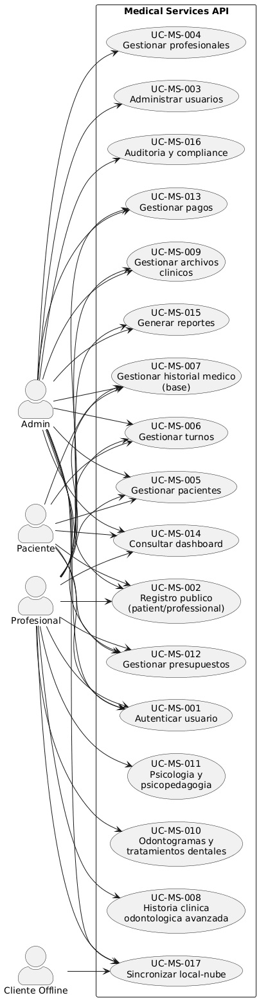
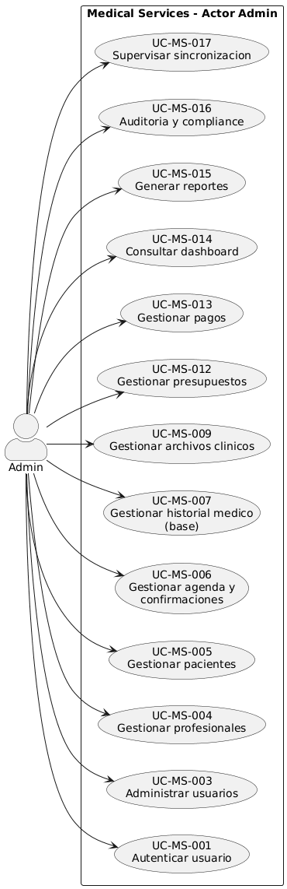
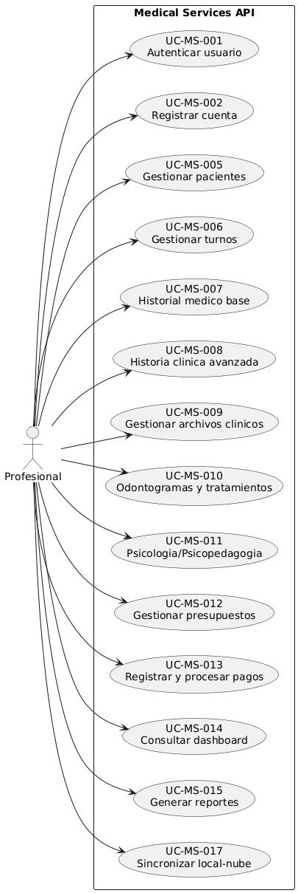
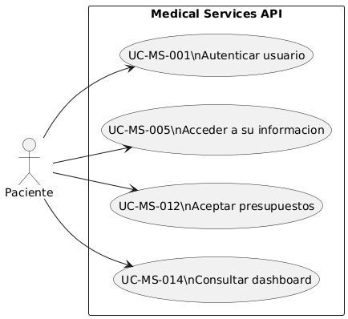
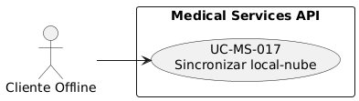
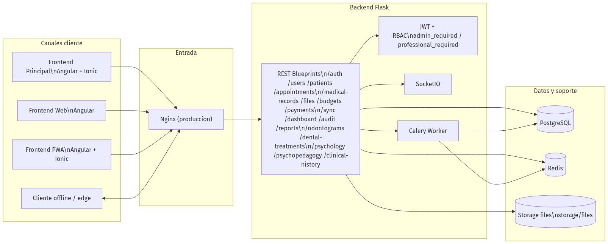

# Requisitos Funcionales y Casos de Uso Reales

Actualizado: 2026-03-01
Proyecto: Medical Services
Autor: Enrique Bobadilla

## 1. Objetivo

Definir requisitos funcionales verificables, mapeados a casos de uso reales implementados en el backend Flask, con trazabilidad directa a endpoints y control de acceso por rol.

## 2. Alcance

- Incluye modulos expuestos por `backend/app/resources/*.py`.
- Incluye arquitectura logica y de despliegue actual en Mermaid.
- Excluye funcionalidades no implementadas o solo planificadas.

## 3. Glosario

| Termino | Definicion operativa |
|---|---|
| API | Interfaz de servicios HTTP expuesta por el backend Flask. |
| Endpoint | Ruta HTTP especifica para una operacion (ejemplo: `POST /api/auth/login`). |
| JWT | Token firmado para autenticacion y autorizacion de solicitudes. |
| RBAC | Control de acceso basado en rol (`admin`, `professional`, `patient`). |
| Blueprint | Agrupador de rutas Flask por dominio funcional. |
| Caso de uso (UC) | Interaccion de negocio observable para un actor. |
| `UC-MS-###` | Identificador unico de caso de uso para Medical Services (ejemplo: `UC-MS-001`). |
| Requisito funcional (RF) | Capacidad obligatoria que el sistema debe cumplir. |
| `RF-###` | Identificador unico de requisito funcional (ejemplo: `RF-001`). |
| Requisito no funcional (RNF) | Restriccion de calidad, seguridad, rendimiento u operacion. |
| `RNF-###` | Identificador unico de requisito no funcional (ejemplo: `RNF-001`). |
| `UC -> RF` | Relacion de trazabilidad entre casos de uso y requisitos funcionales. |
| Idempotencia | Repetir la misma operacion sin duplicar efectos de negocio. |
| Conflicto de sincronizacion | Diferencia entre version cliente y servidor sobre la misma entidad. |
| `server_wins` | Politica de resolucion donde prevalece la version mas reciente del servidor. |
| Trazabilidad | Vinculo verificable entre UC, RF y evidencia tecnica en codigo. |

## 4. Actores

| Actor | Descripcion |
|---|---|
| Administrador | Gestiona usuarios, profesionales, auditoria y reportes sensibles |
| Profesional | Opera pacientes, turnos, historia clinica, presupuestos y pagos |
| Paciente | Accede a su informacion, acepta presupuestos y consume servicios habilitados |
| Cliente offline | Origen de cambios locales para sincronizacion `push/pull` |

## 5. Casos de uso reales (ordenados por modulo)

### Modulo A - Identidad y administracion

| ID | Caso de uso | Actor principal |
|---|---|---|
| UC-MS-001 | Autenticar usuario y emitir JWT | Administrador, Profesional, Paciente |
| UC-MS-002 | Registrar cuenta publica (patient/professional) | Paciente, Profesional |
| UC-MS-003 | Administrar usuarios del sistema | Administrador |
| UC-MS-004 | Gestionar profesionales | Administrador |

### Modulo B - Operacion clinica

| ID | Caso de uso | Actor principal |
|---|---|---|
| UC-MS-005 | Gestionar pacientes y acceso por perfil | Profesional |
| UC-MS-006 | Gestionar agenda de turnos y confirmaciones | Usuario autenticado (confirmacion: profesional/admin) |
| UC-MS-007 | Gestionar historial medico base | Profesional |
| UC-MS-008 | Gestionar historia clinica odontologica avanzada | Profesional |
| UC-MS-009 | Gestionar archivos clinicos asociados | Profesional |
| UC-MS-010 | Gestionar odontogramas y tratamientos dentales | Profesional |
| UC-MS-011 | Gestionar evaluaciones y sesiones de psicologia/psicopedagogia | Profesional |

### Modulo C - Financiero, analitica y compliance

| ID | Caso de uso | Actor principal |
|---|---|---|
| UC-MS-012 | Crear y gestionar presupuestos clinicos | Usuario autenticado (creacion/edicion profesional, aceptacion autenticada) |
| UC-MS-013 | Registrar y procesar pagos | Profesional |
| UC-MS-014 | Consultar dashboard operativo | Usuario autenticado |
| UC-MS-015 | Generar y exportar reportes | Usuario autenticado (subset admin/profesional) |
| UC-MS-016 | Auditar actividad y cumplimiento | Administrador |

### Modulo D - Sincronizacion

| ID | Caso de uso | Actor principal |
|---|---|---|
| UC-MS-017 | Sincronizar cambios local-nube con resolucion de conflictos | Cliente offline, Profesional |

## 6. Requisitos funcionales (RF)

| ID | Requisito funcional | UC relacionados |
|---|---|---|
| RF-001 | El sistema debe autenticar usuarios con email/password y emitir access/refresh token JWT. | UC-MS-001 |
| RF-002 | El sistema debe limitar intentos de login para mitigar abuso (rate limit). | UC-MS-001 |
| RF-003 | El sistema debe permitir registro publico solo para roles `patient` y `professional`. | UC-MS-002 |
| RF-004 | El sistema debe permitir CRUD de usuarios para administradores con filtros y paginacion. | UC-MS-003 |
| RF-005 | El sistema debe restringir lectura/edicion de usuario no admin al propio perfil. | UC-MS-003 |
| RF-006 | El sistema debe permitir alta/baja de profesionales solo por administrador. | UC-MS-004 |
| RF-007 | El sistema debe permitir gestion de pacientes por profesionales y administradores. | UC-MS-005 |
| RF-008 | El sistema debe restringir a paciente la consulta de su propio registro. | UC-MS-005 |
| RF-009 | El sistema debe permitir a usuarios autenticados crear y actualizar turnos, validando conflicto de horario profesional. | UC-MS-006 |
| RF-010 | El sistema debe permitir confirmar turnos con rol profesional/admin. | UC-MS-006 |
| RF-011 | El sistema debe permitir CRUD de historial medico base con escritura por profesionales. | UC-MS-007 |
| RF-012 | El sistema debe gestionar historia clinica avanzada (evoluciones, anamnesis, periodontal, docs, recetas, consentimientos, timeline). | UC-MS-008 |
| RF-013 | El sistema debe permitir carga, descarga y eliminacion de archivos clinicos con control de extension permitida. | UC-MS-009 |
| RF-014 | El sistema debe soportar odontogramas y ciclo de tratamientos dentales. | UC-MS-010 |
| RF-015 | El sistema debe soportar evaluaciones y sesiones de psicologia y psicopedagogia. | UC-MS-011 |
| RF-016 | El sistema debe gestionar presupuestos clinicos con estados y acciones de envio/aceptacion (aceptacion via endpoint autenticado). | UC-MS-012 |
| RF-017 | El sistema debe registrar pagos y permitir su procesamiento. | UC-MS-013 |
| RF-018 | El sistema debe exponer indicadores operativos por dashboard para cualquier usuario autenticado. | UC-MS-014 |
| RF-019 | El sistema debe generar reportes medicos/financieros y permitir exportacion, con endpoints puntuales restringidos por rol. | UC-MS-015 |
| RF-020 | El sistema debe ofrecer auditoria de actividad con filtros y reportes de compliance solo para admin. | UC-MS-016 |
| RF-021 | El sistema debe sincronizar cambios en lotes con limite maximo (`MAX_SYNC_CHANGES=500`). | UC-MS-017 |
| RF-022 | El sistema debe aplicar idempotencia por `idempotency_key` o fingerprint en `sync push`. | UC-MS-017 |
| RF-023 | El sistema debe detectar conflictos por `updated_at` y devolver resolucion `server_wins`. | UC-MS-017 |
| RF-024 | El sistema debe proteger endpoints sensibles con JWT y RBAC (`admin_required`, `professional_required`). | UC-MS-001, UC-MS-003, UC-MS-004, UC-MS-006, UC-MS-007, UC-MS-016, UC-MS-017 |

## 7. Requisitos no funcionales minimos (RNF)

| ID | Requisito no funcional | Evidencia |
|---|---|---|
| RNF-001 | Seguridad de acceso por token JWT en API. | Decoradores y `@jwt_required` en `backend/app/resources/*.py` |
| RNF-002 | Control de permisos por rol en operaciones criticas. | `backend/app/utils/decorators.py` |
| RNF-003 | Trazabilidad operativa de sincronizacion y auditoria. | `sync_logs` y endpoints `api/audit/*`, `api/sync/logs` |
| RNF-004 | Escalabilidad horizontal de servicios en contenedores. | `docker-compose.yml`, `docker-compose.prod.yml` |
| RNF-005 | Separacion de responsabilidades por capas (API, datos, cache, worker, clientes). | Arquitectura definida en seccion Mermaid |

## 8. Matriz de trazabilidad UC -> RF

| Caso de uso | RF cubiertos |
|---|---|
| UC-MS-001 | RF-001, RF-002, RF-024 |
| UC-MS-002 | RF-003 |
| UC-MS-003 | RF-004, RF-005, RF-024 |
| UC-MS-004 | RF-006, RF-024 |
| UC-MS-005 | RF-007, RF-008 |
| UC-MS-006 | RF-009, RF-010, RF-024 |
| UC-MS-007 | RF-011, RF-024 |
| UC-MS-008 | RF-012 |
| UC-MS-009 | RF-013 |
| UC-MS-010 | RF-014 |
| UC-MS-011 | RF-015 |
| UC-MS-012 | RF-016 |
| UC-MS-013 | RF-017 |
| UC-MS-014 | RF-018 |
| UC-MS-015 | RF-019 |
| UC-MS-016 | RF-020, RF-024 |
| UC-MS-017 | RF-021, RF-022, RF-023, RF-024 |

  <h3>UML global de casos de uso</h3>
  

### UML por actor

  <h4>Admin</h4>
  

  <h4>Profesional</h4>
  

  <h4>Paciente</h4>
  

  <h4>Cliente Offline</h4>
  

## 10. Diseno de arquitectura

